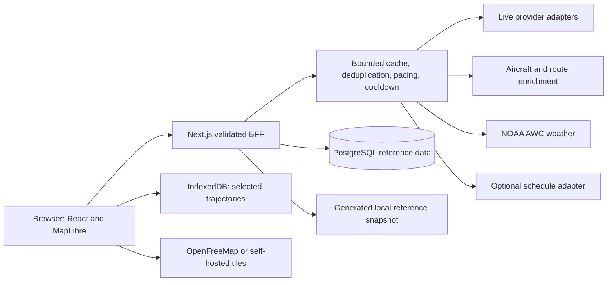
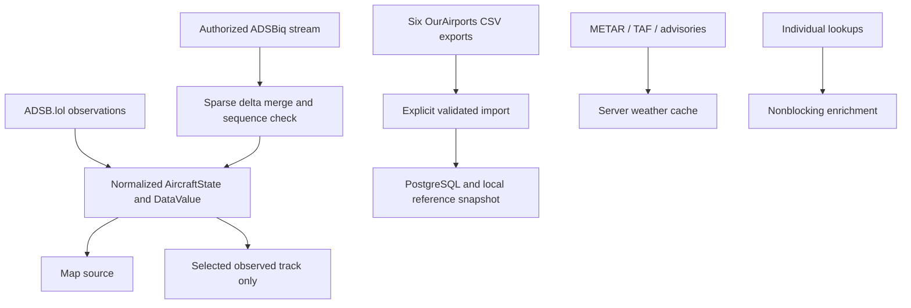

# AviTrack

A map-first aviation application built with Next.js, TypeScript and MapLibre. It uses real regional aircraft observations, stores selected-aircraft trajectories locally, and combines them with airport reference data and aviation weather. There is no production demo feed and no silent sample-aircraft fallback.

**Live ADS-B tracking is not the same thing as airline schedule/status data.** Gates, cancellations, codeshares and supplier arrival estimates require a separate schedule provider. A missing aircraft is not evidence that a flight landed or was cancelled.

## What Runs Without a Paid API

- Real ADSB.lol regional traffic and direct aircraft lookup.
- WebGL aircraft symbols, track-based rotation, follow, interpolation and freshness states.
- Selected-aircraft observation trails in IndexedDB, charts, map/chart cursor synchronization and local replay.
- Aircraft metadata and individual callsign-route enrichment through ADSBDB.
- Universal aircraft/airport/code search, filters, a virtualized traffic table, local favorites and three-aircraft telemetry comparison.
- OurAirports airport pages, runway geometry, radio frequencies and nearby navaids.
- Server-side METAR/TAF, bulk METAR station layer, SIGMET/international SIGMET, G-AIRMET and PIREP overlays.
- Great-circle distance/bearing/progress, conditional estimated remaining time, optional projected tracks, range rings and twilight shading.
- Responsive desktop panels/mobile sheets, local units/time preferences, shareable map state, PWA shell and explicit offline states.

Optional Airplanes.live, ADSBiq, OpenSky and AirLabs adapters are disabled unless their required access and configuration gates are satisfied. Read [the licensing review](docs/DATA_LICENSES.md) before enabling or deploying any provider.

### Screenshots

Screenshot placeholder for release documentation: desktop live map, selected flight, mobile bottom sheet and airport reference view. `npm run test:e2e` generates desktop/mobile screenshots under `test-results/`. Those acceptance screenshots use explicitly labeled test fixtures, not purported live traffic.

## Architecture





## Local Setup

Requires **Node.js 22.12 or newer** and npm. No account is needed for the default live map.

```powershell
npm ci
npm run data:sync -- --files-only
npm run dev
```

Open **http://localhost:3000**. The worker preparation script runs automatically on install, development startup and build. Fonts and MapLibre workers are hosted by the app, not a third-party script CDN.

The reference import is optional for the live map but required for airport search/pages and reference overlays. Missing files produce an explicit unavailable state. The import downloads official current data, not a bundled sample database.

Use `.env.local` for local configuration, following `.env.example`. Empty credentials leave optional services off. Never place secrets in `NEXT_PUBLIC_*` variables or source control.

## Configuration

| Variable                                  | Purpose / default                                                                |
| ----------------------------------------- | -------------------------------------------------------------------------------- |
| `LIVE_PROVIDER`                           | `adsblol`; also `airplanes`, `adsbiq`, `opensky` with authorization gates        |
| `FALLBACK_LIVE_PROVIDER`                  | `none`; optional permitted `adsblol` or `airplanes`                              |
| `LIVE_REFRESH_MS` / `SELECTED_REFRESH_MS` | 5000 / 2500; provider pacing and 429 cooldown can make effective refresh slower  |
| `DATABASE_URL`                            | Optional PostgreSQL connection; required for durable schedule quota accounting   |
| `NEXT_PUBLIC_MAP_STYLE_URL`               | Public MapLibre style URL; empty selects OpenFreeMap day/night styles            |
| `MAP_ASSET_ORIGINS`                       | Comma-separated HTTPS origins allowed by the map CSP                             |
| `ADSBIQ_*`                                | Server-only key, tier and separate access/global-display confirmations           |
| `GLOBAL_LIVE_MODE`                        | False by default; no simulated global coverage                                   |
| `OPENSKY_*`                               | License confirmation and optional OAuth2 client credentials                      |
| `SCHEDULE_PROVIDER`                       | `none` or `airlabs`; never supplies map positions                                |
| `SCHEDULE_MONTHLY_BUDGET`                 | Zero disables schedule spending; configure below the actual account allowance    |
| `AIRSPACE_PROVIDER` / `NOTAM_PROVIDER`    | `none`; interfaces exist, authorized adapters are not installed                  |
| `WEATHER_OVERLAY`                         | Advertises weather-layer availability; true by default                           |
| `TRUST_PROXY`                             | False; enable only with a trusted proxy that overwrites forwarded IP headers     |
| `LOG_LEVEL`                               | `silent`, `error`, `info`, `debug`; does not log credentials/upstream keyed URLs |
| `PORT` / `HOSTNAME`                       | Production listen address; 3000 / 0.0.0.0                                        |

The reference service can read a filename supplied by `REFERENCE_DATA_FILE` **inside `data/` only**. Tests use this explicitly; production should leave it unset. No fixture fallback exists.

## PostgreSQL and Airport Import

Use a managed PostgreSQL database with TLS or your own PostgreSQL 16+ instance. A local-only Docker Compose example is included:

```powershell
docker compose up -d db
```

The Compose database is bound to loopback and uses a development-only password. Do not reuse that password or expose this configuration publicly. Set `DATABASE_URL` in your environment, then:

```powershell
npm run db:migrate
npm run data:sync
```

`scripts/sync-ourairports.ts` downloads airports, runways, frequencies, navaids, countries and regions; validates mandatory headers and every row; preserves nullable values; writes an atomic local snapshot; and upserts the typed PostgreSQL tables in a transaction when configured. It records synchronization time and counts. Complete runway/navaid fields are retained in typed JSONB, alongside indexed searchable columns.

Run the sync nightly or weekly in a maintenance job, not during browser requests. Restart long-lived application processes after replacing the local snapshot. The default tracker does **not** archive worldwide aircraft positions.

## Commands

```powershell
npm run dev
npm run typecheck
npm run lint
npm test
npm run build
npx playwright install chromium
npm run test:e2e
npm start
```

`npm start` prepares static assets and starts Next.js's standalone server. End-to-end tests run their own production instance on port **3100**, with mocked aviation APIs, mocked map resources and an explicit airport fixture. They do not require or consume live aviation API access.

See [acceptance coverage](docs/ACCEPTANCE.md) for network verification, tested behaviors and remaining limits. Production dependency audit: `npm audit --omit=dev`.

## Deployment

1. Review [data licenses](docs/DATA_LICENSES.md). ADSB.lol asks production integrators to contact its operator before launch.
2. Set server environment variables. Keep optional providers disabled until access and intended redistribution are permitted.
3. Provision PostgreSQL if desired, apply migrations, and run the airport import. Live tracking remains independent of database availability.
4. Run tests and the production build. Serve the standalone output plus `public/`, `.next/static/` and generated airport data, or use the supplied Dockerfile.
5. Terminate HTTPS at a trusted reverse proxy. Disable buffering for `/api/live-stream` if authorized streaming is enabled. PWA installation requires HTTPS outside localhost.
6. Start with **one BFF process/replica**. Request pacing, circuit breakers and ordinary caches are process-local. Multiple replicas require a shared rate limiter/cache before scaling; do not multiply provider budgets across replicas. Schedule credits are protected with atomic PostgreSQL accounting.
7. Add edge request/body limits, health monitoring and a daily airport maintenance job. Never turn this BFF into an arbitrary URL proxy.

```powershell
docker build -t avitrack .
docker run --rm -p 3000:3000 --env-file .env.local avitrack
```

The Docker build explicitly imports the public airport data. For serverless deployments, bake in the snapshot or use PostgreSQL; runtime filesystems may be ephemeral. ADSBiq shared streaming is intended for a persistent Node process, not a short-lived function.

### Self-Hosted Maps

PMTiles protocol support is registered with MapLibre. Supply a MapLibre style whose vector source points at a `pmtiles://https://.../archive.pmtiles` URL, with matching source layers, sprite and glyph URLs. Add those HTTPS origins to `MAP_ASSET_ORIGINS`. Protomaps-derived data must retain its applicable OSM/other attribution. No OSM community standard raster tile endpoint is used.

## Provider Economics and Limits

- One regional query of at most 250 NM; no geographic fan-out to manufacture global coverage.
- ADSB.lol outbound requests are paced at least 1.1 seconds apart. Selected and regional targets are polling goals, not guaranteed source refresh rates.
- Hidden tabs stop periodic TanStack queries; streams close while hidden. Server promise deduplication/cache reduces duplicate tab requests.
- `429` and `Retry-After` trigger a shared provider cooldown. Permanent 4xx responses are not retried. Repeated failures open a 30-second circuit.
- Ordinary cache entries have distinct TTLs, a 512-entry cap and an estimated 40 MiB payload budget.
- Route results are individual, transient lookups, never bulk mirrored or cached offline.
- Schedule requests require an explicit monthly budget and PostgreSQL. Billing requests are not automatically retried. Supplier records are not silently joined to unrelated callsigns.

## Known Limits

- This is not an operational aviation product, worldwide flight history database, or guaranteed global tracker.
- Public callsign routes may be wrong or reused. Photos are not hotlinked without verified permission and attribution.
- Airline code lookup is supported; a complete global airline-name directory is not bundled. Aircraft-type lookup support varies by provider.
- Conservative phase inference currently reports parked/taxi/climb/cruise/descent/unknown. It does not manufacture takeoff/landing/approach certainty from MSL altitude alone.
- Comparison covers current telemetry and separation for up to three observed aircraft. Only the selected aircraft's captured trail is actively recorded and rendered.
- Projection assumes stable current track/speed and is suppressed during significant turns or stale data; it is not a flight plan or a calibrated uncertainty model.
- The default map supports day/night themes and pitch. No terrain DEM, globe mode, dedicated 3D building layer or filed-route supplier is bundled.
- Background alerts, account sync, authorized NOTAM/airspace providers and archive ingestion are not implemented/enabled. No closed-browser monitoring is promised.
- AirLabs boards have a documented near-term window; arbitrary future schedules and automatically confirmed diversions cannot be promised.
- PostgreSQL connectivity and credentialed optional services need deployment-specific verification. These were not network-tested without credentials/runtime.

## Adding a Provider

Implement the relevant contract in `src/lib/providers/contracts.ts`, add a fixed upstream mapping and limits, validate external responses with Zod, normalize into provenance-bearing models, and add representative fixtures and error tests. Do not add a caller-controlled upstream URL. Record current terms, redistribution permissions, rate limits and review date in [DATA_LICENSES](docs/DATA_LICENSES.md).

Further documentation: [architecture](docs/ARCHITECTURE.md), [data model](docs/DATA_MODEL.md), [contributing](CONTRIBUTING.md).This is a [Next.js](https://nextjs.org) project bootstrapped with [`create-next-app`](https://nextjs.org/docs/app/api-reference/cli/create-next-app).

## Getting Started

First, run the development server:

```bash
npm run dev
# or
yarn dev
# or
pnpm dev
# or
bun dev
```

Open [http://localhost:3000](http://localhost:3000) with your browser to see the result.

You can start editing the page by modifying `app/page.tsx`. The page auto-updates as you edit the file.

This project uses [`next/font`](https://nextjs.org/docs/app/building-your-application/optimizing/fonts) to automatically optimize and load [Geist](https://vercel.com/font), a new font family for Vercel.

## Learn More

To learn more about Next.js, take a look at the following resources:

- [Next.js Documentation](https://nextjs.org/docs) - learn about Next.js features and API.
- [Learn Next.js](https://nextjs.org/learn) - an interactive Next.js tutorial.

You can check out [the Next.js GitHub repository](https://github.com/vercel/next.js) - your feedback and contributions are welcome!

## Deploy on Vercel

The easiest way to deploy your Next.js app is to use the [Vercel Platform](https://vercel.com/new?utm_medium=default-template&filter=next.js&utm_source=create-next-app&utm_campaign=create-next-app-readme) from the creators of Next.js.

Check out our [Next.js deployment documentation](https://nextjs.org/docs/app/building-your-application/deploying) for more details.
