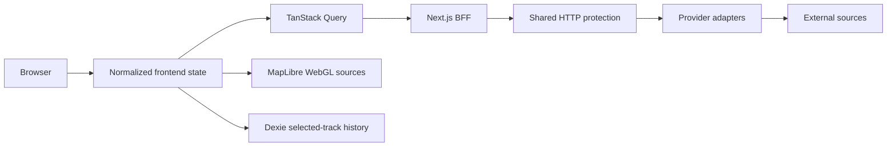
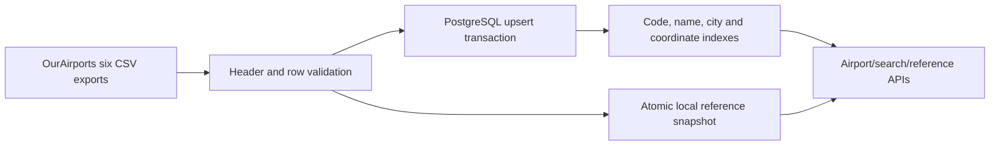

# Architecture

## Boundaries

The browser never calls secret-key aviation APIs. All aviation requests are validated and restricted to known upstreams. MapLibre directly requests public configured map assets. Source code contains no production aircraft fixtures.

## Live ADS-B

`/api/live` selects the configured provider and permitted fallback. Readsb-style responses are normalized per aircraft; malformed essential positions are rejected without dropping the entire response. `ground`, non-ICAO identifiers and separate message/position timestamps are preserved.

The default regional radius is calculated from the viewport and capped at 250 NM. A world viewport pauses regional queries rather than issuing many cells. Selected-aircraft queries are independent. TanStack pauses interval refetch in hidden tabs. Shared process state preserves request deduplication, pacing and cooldown across route handlers and development reloads.

MapLibre symbols render all targets in one GeoJSON source, not React markers. A bounded interpolation buffer advances between observed positions using great-circle calculations and shortest-angle rotation. It does not dead-reckon indefinitely. Source updates are throttled to 10 Hz; React does not rerender each plane per animation frame.

## Optional Streaming

ADSBiq credentials stay in the Node process. The server validates full and delta frames, merges sparse objects, applies removals and checks sequence continuity. A gap or malformed frame reconnects for a full snapshot. Position timestamps are retained across unrelated sparse updates.

The browser subscribes through SSE. Connections are shared by rounded zone and limited to three upstream zones per process. Reconnect uses bounded exponential delay and jitter. Global display requires an additional authorization flag because current public terms prohibit whole-feed republication without permission. Credentialed live access is not assumed from API documentation alone.

## Airport Reference

The importer is an explicit maintenance command. Browser requests never download global CSVs. PostgreSQL is preferred when configured; the generated local file keeps reference features usable without account persistence. The local snapshot is cached in memory and requires a process restart after replacement. Airports and every runway/navaid field remain typed; JSONB retains source detail while indexed columns support common queries.

## Weather

The weather BFF calls NOAA AWC. Station METAR and TAF requests settle independently so missing forecasts do not discard observations. HTTP 204 means no data. Bulk compressed METAR CSV is parsed on the server and cached for map stations. SIGMET, international SIGMET, G-AIRMET and geographically bounded PIREPs use validated GeoJSON. Product coverage is not global by implication.

## Schedules

`SCHEDULE_PROVIDER=none` is fully functional. An enabled AirLabs adapter consumes credits only for explicit detail/board requests. An atomic PostgreSQL upsert reserves monthly credits before the external call; failure to persist the budget fails closed. Background requests would be stopped before the final ten percent of budget. Cache/deduplication precede credit consumption. No automatic billing retries occur.

Records include dates and nullable supplier fields. The current UI presents them separately instead of silently promoting a weak callsign match to confirmed flight identity. The `scheduleMatches` helper requires registration, matching identifier and a bounded departure window; richer record-matching/route precedence can be added only with stronger source evidence.

## Local History

Only selected aircraft produce persistent observations. The history pipeline deduplicates timestamps, rejects impossible jumps, preserves turns/altitude changes, breaks long gaps, and caps points/retention. The map draws actual observed segments separately from direct geodesic references and projected tracks. Charts and playback consume the same observation timestamps.

IndexedDB holds up to 50 recent tracks, 3,600 points each; unbookmarked tracks older than seven days are pruned. It is not a global archive. Settings, watchlists and recent searches use local storage. Account/background-monitoring systems are intentionally absent rather than fake endpoints.

## Caching and Security

The HTTP layer provides timeout, abort, bounded retries with jitter, no permanent-4xx retry, Retry-After handling, provider-wide cooldown, a circuit breaker, validation and structured health/logging. Cache keys include the fixed provider and path; keyed URLs are never logged. Caches use per-product TTLs and bounded estimated memory.

The proxy only accepts bounded GET parameters and known provider names; it is not an open proxy. Headers include CSP, nosniff, anti-framing, referrer and permissions policies. Production CSP does not allow eval; inline scripts are currently allowed for Next hydration. Deployments requiring nonce-based strict CSP should add a request nonce pipeline before tightening this policy.

In-process limiter/cache state requires a single BFF replica. Add a shared limiter/cache for horizontal scaling, coordinated across every instance using the same upstream credentials. Trust forwarded IPs only behind an edge that overwrites them. Schedule quota accounting already uses PostgreSQL for durable cross-process reservation.

## Offline and Deployment

The service worker caches the shell, installed worker/font assets, and individually opened airport/aircraft reference data. It never caches live positions, weather, schedules, or public route lookup responses. Offline status is explicit. Maps are not bulk-downloaded for offline use.

Next standalone output is the production artifact. The start script copies static/public/reference assets before launching it. Docker uses a non-root runtime and imports reference data during build. Persistent Node hosting is required for shared streaming; serverless platforms can use REST mode and PostgreSQL/baked-in reference data instead.
